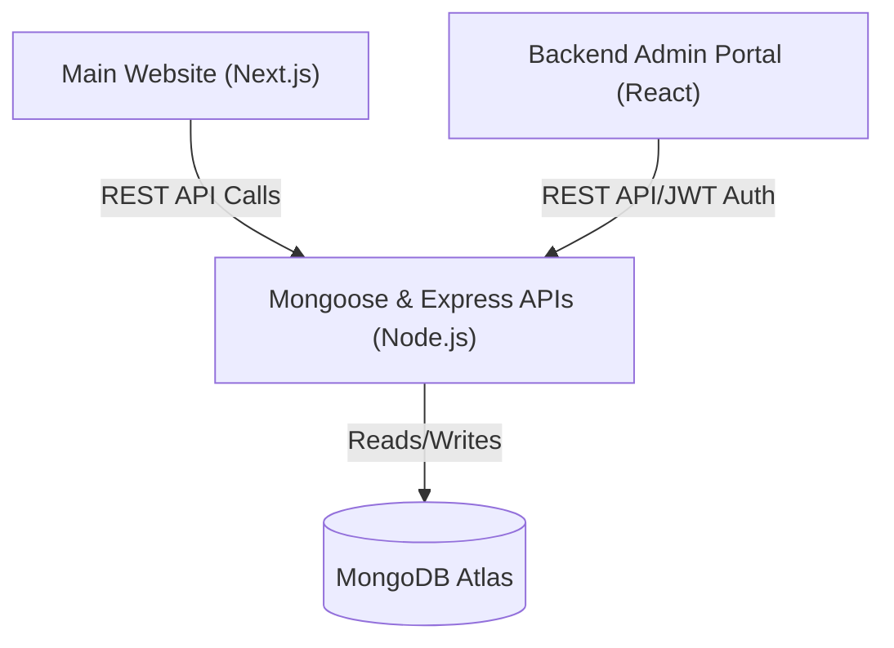

# Warehouse Pickup & Auction Fulfillment System

## 1. System Overview
The **Warehouse Pickup & Auction Fulfillment System** aims to streamline warehouse management, sorting, appointment scheduling, and order releases. It bridges the gap between auction results (from platforms like HiBid or AuctionFlex) and physical item pickup by structured appointment bookings and efficient warehouse sorting.

## 2. Requirements & Module Breakdown
As extracted from the WBS provided, the system is strictly limited to Phase 1 scope with no complex features like AI matching or dynamic routing.

### 2.1 Backend Services (Node.js/Express + MongoDB)
* **Auth System:** Role-based access control (Admin, Worker, Clerk) using JWT sessions. No SSO/OAuth biometric auth.
* **Core Database:** MongoDB schemas mapping orders, lots, users, and bookings. Entity linkage handles order-to-lot mappings.
* **Data Import Pipeline:** Handles CSV/Excel uploads (Max 3 formats: HiBid, AuctionFlex, ManyFastScan). Parses bidder numbers to link associated orders. Implements fixed "B-prefix" logic for storage classification.
* **Queue & Prep Engine:** Queue system without AI optimization. Uses static logic for appointment/rack-based sorting. Includes a BIN assignment system (maximum predefined bins) and rule-based "prepared" status updates.
* **Booking Engine:** Generates unique booking links per order. Manages time slot capacities statically. Allows customers to select a slot for pickup (no rescheduling in v1).
* **Pickup & Release Operations:** API for searching customers/bidders. Customer check-in endpoints. Handles partial or lot-level releases with basic pickup logs.
* **Notifications Engine:** Automated trigger-based SMS (via 3rd party API) and Email (static templates).
* **Admin Utilities:** Endpoints for full order listings, basic date/status filters, and CSV export logic.

### 2.2 Main Website (Next.js)
This handles the customer-facing booking and tracking processes. It uses Next.js for high performance and SEO compatibility.
* **Booking Page:** UI presenting available time slots for the customer's unique booking link.
* **Confirmation Page:** Displays order summaries and booking confirmation logic.

### 2.3 Backend UI / Admin Portal (React Vite)
This acts as the management platform for staff and admins. 
* **Dashboard:** Main admin overview interface.
* **Data Hub:** User interfaces for fast and responsive file (CSV) uploads.
* **Queue View:** Prep queue interface built with responsive UI, targeting mobile view contexts for workers on the floor. Includes camera-based scanner support (device-dependent).
* **Search & Delivery Hub:** Screens for customer checking, search lookups, and lot-level order release confirmations.

## 3. Multi-Application Monorepo Architecture

The repository will be implemented as an **NPM Monorepo**. This approach centralizes all interconnected services, making unified linting, building, and deployment manageable without complex tooling.



### 3.1 Proposed Directory Structure
```text
warehouse-pickup/
|-- package.json           # Root workspace configuration
|-- apps/
|   |-- client/            # Next.js main website
|   |-- admin/             # React (Vite) admin dashboard
|   |-- api/               # Express API and core logic
|-- README.md
```

## 4. Next Steps & Development Milestones
1. Initialize Git and establish monorepo workspaces configuration.
2. Bootstrap isolated application targets (`apps/client`, `apps/admin`, `apps/api`).
3. Connect remote repository to `https://github.com/Tecosys/Warehouse-Pickup-Auction-Fulfillment-System.git`.
4. Define standard Mongoose schemas conforming to the import pipeline and data requirements.
